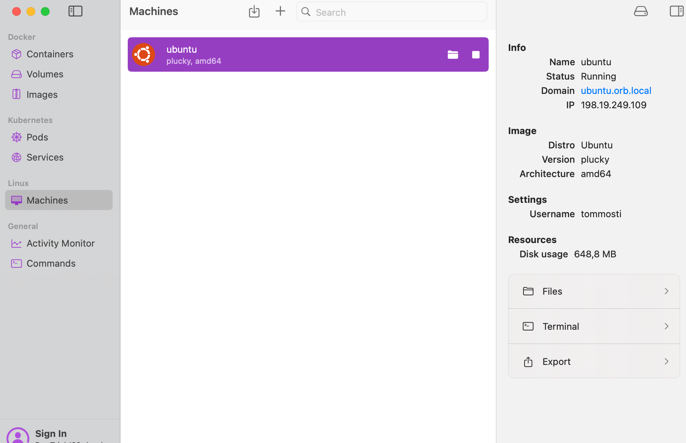
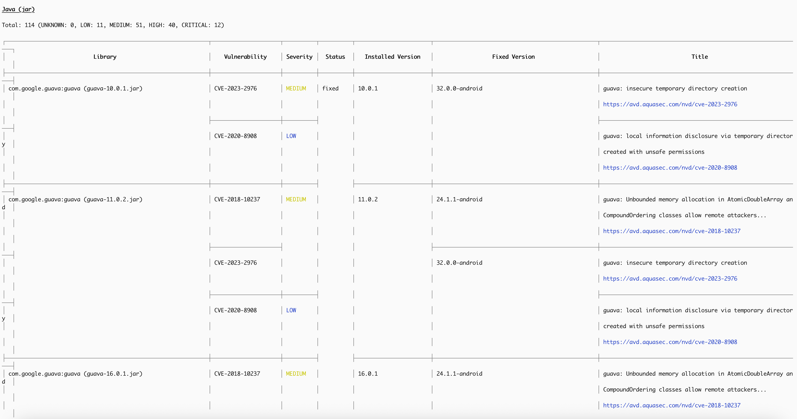
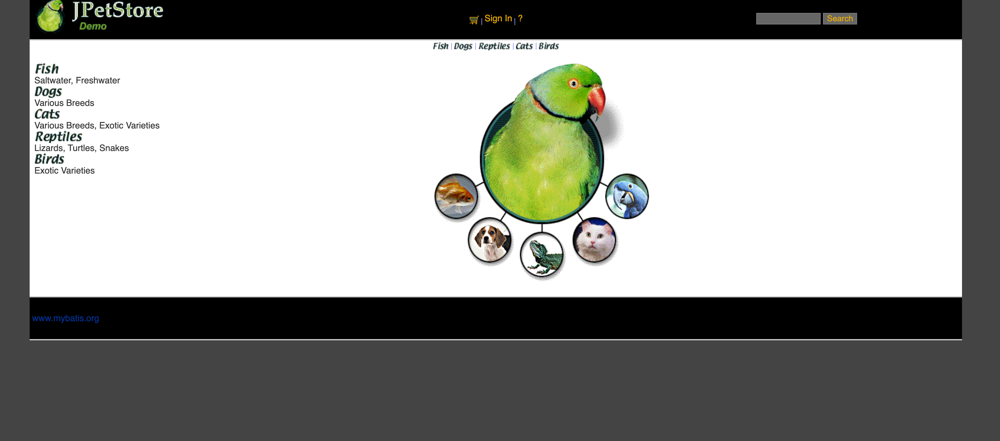

Ynov JPetStore
=================

## Création VM avec orbstack


## Installer trivy et vérifier les vulnérabilités



## Site fonctionnel 



## Run on Docker
```
docker build . -t jpetstore
docker run -p 8080:8080 jpetstore
```
or with Docker Compose:
```
docker compose up -d
```

## Try integration tests

Perform integration tests for screen transition.

```
$ ./mvnw clean verify -P tomcat90
```
